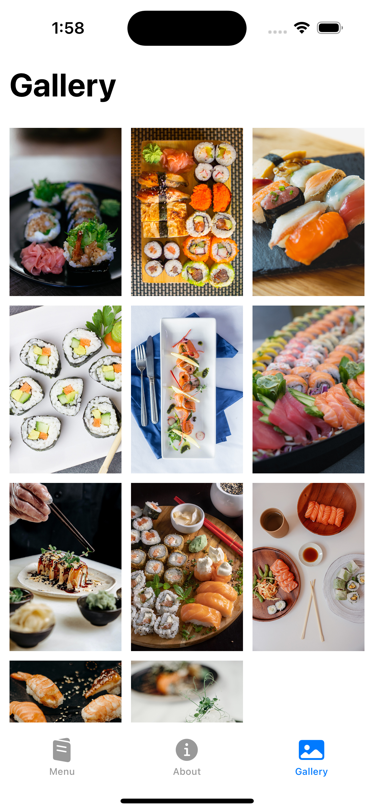

# Restaurant-App
🍽 SwiftUI-based Restaurant App: Efficiently showcases restaurants with list rendering, tab bar navigation, detailed views, and a dynamic gallery using LazyVGrid. Also features an interactive large bottom sheet.

  

  

  

  

  

  

